# 8. Création d'API avec FastAPI

Dans ce chapitre, nous allons voir comment rendre votre IA disponible au monde entier et de manière sécurisée.

Avant de commencer, afin que tout le monde parte du même point, vérifiez que vous n'avez aucune modification en
cours sur votre working directory avec `git status`.
Si c'est le cas, vérifiez que vous avez bien sauvegardé votre travail lors de l'étape précédente pour ne pas perdre
votre travail.
Sollicitez le professeur, car il est possible que votre contrôle continue en soit affecté.

Sinon, annulez toutes vos modifications avec `git reset --hard HEAD`. Supprimez potentiellement les fichiers
non indexés.
Changez maintenant de branche avec `git switch step05`.
Créez désormais une branche avec votre nom : `git switch -c votrenom/step05`

Dans cette partie, nous allons désormais nous concentrer sur le code que vous trouverez dans `cats_dogs_other/api` :

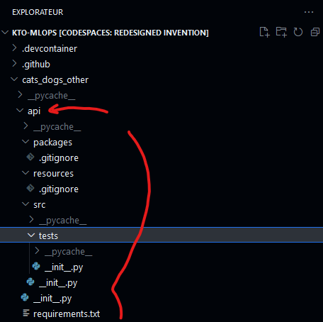

Petit disclaimer, ce chapitre et les deux suivants font partie du cours que j'avais donné l'année dernière. Il avait à
l'époque été rédigé dans un anglais approximatif. Je n'ai malheureusement pas eu le temps de revoir tout cela, 
par contre, ces chapitres ont été adapté pour ce cours. Certaines illustrations ne reflèteront peut-être pas la réalité
(nom des packages python par exemple), mais les codes, noms de dossiers, dans la partie textuelle ont été mis à jour.

Je vous remercie d'avance pour votre compréhension.

## FastAPI
## OpenAPI / Swagger et la documentation
## Sécurité avec oAuth2

# REST API

## Introduction

### Abstract

What is MLOps?

Where are we in the MLOps Timeline?


What is the purpose of the Deployment step? Why do we turn our model into a Webservice?

The full content of this course [is here.](00_materials/08_fastapi_and_webservices/api_and_deployment.md)

### The tools

To develop, we will use GitHub Codespaces. 

**NEVER EVER FORGET TO STOP YOUR CODESPACES ENVIRONMENT AFTER USING IT**

To test our API, we will use Bruno

### Prerequisite

To have followed the previous steps of this course.


## 1 - Develop a REST Webservice with FastAPI

### a - What is a REST API ? An HTTP Request ? What are GET/PUT/POST/DELETE verbs ?

A REST API is a WebService specification which is using the REST (Representational State Transfer) constraints. We will
not be exhaustive on this point in this course (more information here : https://en.wikipedia.org/wiki/Representational_state_transfer).

In this course, we will use this terms in order to specify our WebService. It means we will create an application which
allows us to share our ML model with other web applications (in this case, our front) in real time.

These web applications will interact each others with HTTP Requests. HTTP for HyperText Transfer Protocol, is a
client-server protocol used for web transmissions.


*Demonstration with a Web Browser*

HTTP requests relies on verbs, bodies and URIs in order to exchange information between web applications, specially a client
and a server.

URI : The identifier of a resource
Verb : The action we want to do on a specific resource
Body : The body of the HTTP request

An example with products :


A second one :


Note that the format of the responses here is not specify but often, bodies are write in JSON.
Types and format can be force with Http headers.

The most useful http verbs are :

- **GET** : To get resources
- **POST** : To create resources
- **PUT** : To update resources
- **DELETE** : To delete resources

### b - Install Bruno and test it

Download Bruno

Follow the installation process and then

**Now, a Quick demonstration**

### c - Create our first route (/health) with FastAPI and Uvicorn

In this part, we will create our first http route : /health. This route, returns the actual state of our service. If it is correctly started, it returns "OK".

FastAPI is a Framework used for building APIs in Python. It brings us tools to allow us to develop our first http webservice.

Uvicorn is a Webserver for Python. It starts a fully usable web server instance in order to bring our WS to the WORLD!

Create or restart your codespaces environment.

Now, we install FastAPI and uvicorn.
In `cats_dogs_other/api/requirements.txt`, add at the bottom of the file:
```
fastapi==0.115.6
fastapi-utils==0.2.1
uvicorn==0.27.0
httpx
```

Nous savons également, que nous allons avoir besoin du package wheel d'inférence. Tout comme pour l'entraînement,
ajoutons la copie du wheel dans le répertoire `cats_dogs_other/api/packages` dans le script `init_packages.sh`.
Cela donnerait ceci : 
```bash
pip install --upgrade pip
pip install build

pip install -e packages/inference

cd packages/inference/
python -m build --sdist --wheel
cd dist
cp *.whl ../../../cats_dogs_other/train/packages
cp *.whl ../../../cats_dogs_other/api/packages
cd ../../../

```
Testez que cela fonctionne avec la commande :
```bash
./init_packages.sh
```
Vous devriez avoir ceci :


Ajoutons maintenant la dépendance dans le fichier `cats_dogs_other/api/requirements.txt` :
```
fastapi==0.115.6
fastapi-utils==0.2.1
uvicorn==0.27.0
httpx
./cats_dogs_other/api/packages/kto_keras_inference-0.0.1-py3-none-any.whl
```

Jouez maintenant cette commande pour installer ces dépendances :
```bash
pip install -r cats_dogs_other/api/requirements.txt
```

Lets go to the code.

First, we add a new python script where we will create our routes : index.py

And then, we create our new file:

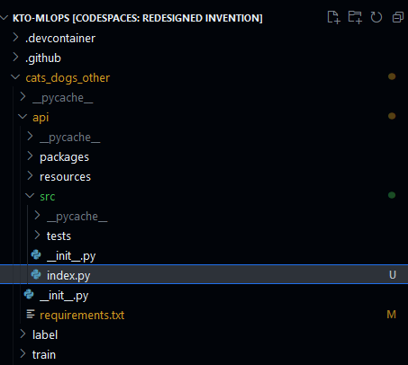

Now, we create our route !
```python
from fastapi import FastAPI

app = FastAPI()


@app.get("/health")
def health():
    return {"status": "OK"}

```

Note that this new route allows our clients to get the status of the service. So we use the http verb **GET**.

Now, we want to test this new route !! To do so, we need to launch a uvicorn server. 
To launch it, we create a new script in the root of the project: `boot.py`


Personally, I like to add this new script at the root of this project, because it is easier to launch scripts 
and unit tests from the root. It makes import management more reliable.

In boot.py, we launch the FastAPI application in a local web server, on the classic port : 8080
```python
import uvicorn

from cats_dogs_other.api.src import index

if __name__ == "__main__":
    uvicorn.run(index.app, host="0.0.0.0", port=8080)

```

Now, we launch this script from the Terminal:

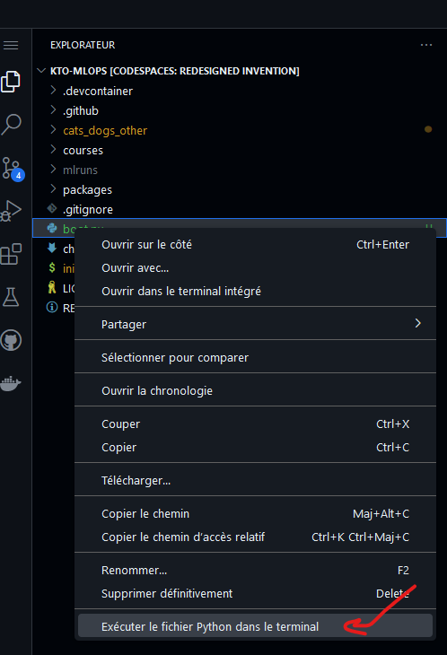


To test it, first make your codespaces process Public


Now it is Public, you can access it from you brower, or your local Bruno
Copy the url of your process and paste it in your favorite tool. Then, add the route /health at the end of the url.

It should look like this :
https://blablabla-8080.preview.app.github.dev/health

And the result is :


Dans Bruno, créez une nouvelle Collection :

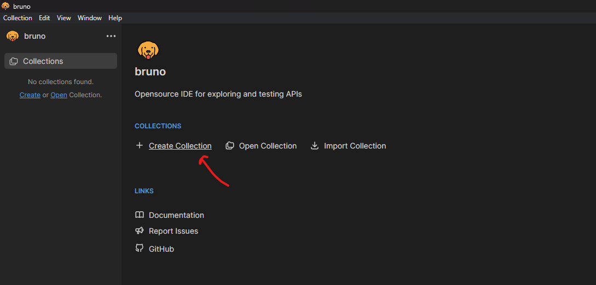
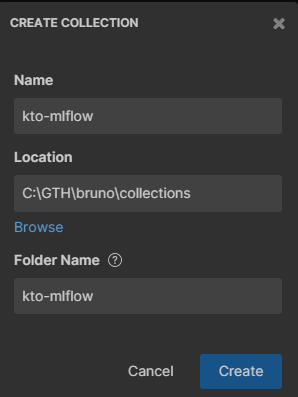

Maintenant, créez une requête : 

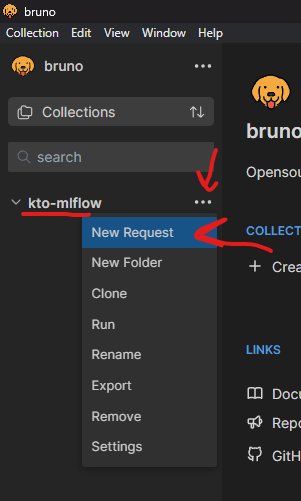
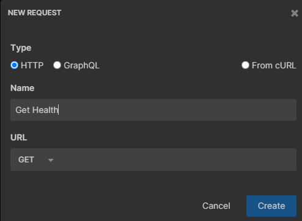

Saisissez l'url comme suit, sauvegardez et exécutez : 


Fermez maintenant votre serveur avec un CTRL+C dans le terminal : 


### d - Expose our model

Now we want to expose our cats and dogs classification model. First, we take sure that we have our inference module 
in requirements:


We will use the code of the package to do the classification from a file.

Now, we have to create a new route in order to allow our users to send an image. First, let's talk about multipart form data.

It is a specific content type for our request body. It is very useful to send files through http.

To allows multipart in our production project, we have to add the following dependency:

```
python-multipart==0.0.6
```

Votre fichier devrait ressembler à ceci : 
```
fastapi==0.115.6
fastapi-utils==0.2.1
uvicorn==0.27.0
httpx
./cats_dogs_other/api/packages/kto_keras_inference-0.0.1-py3-none-any.whl
python-multipart==0.0.6
```

And then, refresh our environment :

```bash
pip install -r ./cats_dogs_other/api/requirements.txt
```

Chargeons maintenant notre modèle. Dans un premier temps, nous allons ajouter à la main notre .keras directement dans notre
répertoire. Remarquez la présence d'un dossier `./production/api/resources`. C'est ici que nous mettrons notre .keras.
Notez qu'un fichier .gitignore est déjà présent. Il vous empêchera de pousser le modèle copié à la main dans votre 
repository git. Nous verrons comment automatiser le téléchargement de votre artifact directement depuis kto-mlflow,
plus loin dans ce cours.

Commencez par télécharger le modèle de votre dernier run réussi dans votre mlflow. Il faudra peut-être allumer
kto-mlflow avec Dailyclean voire, également démarrer Dailyclean à la main. Normalement, vous savez déjà le faire
par vous même ;-) Sinon, vous trouverez votre bonheur dans ce [chapitre](06_ml_platforms.md) :

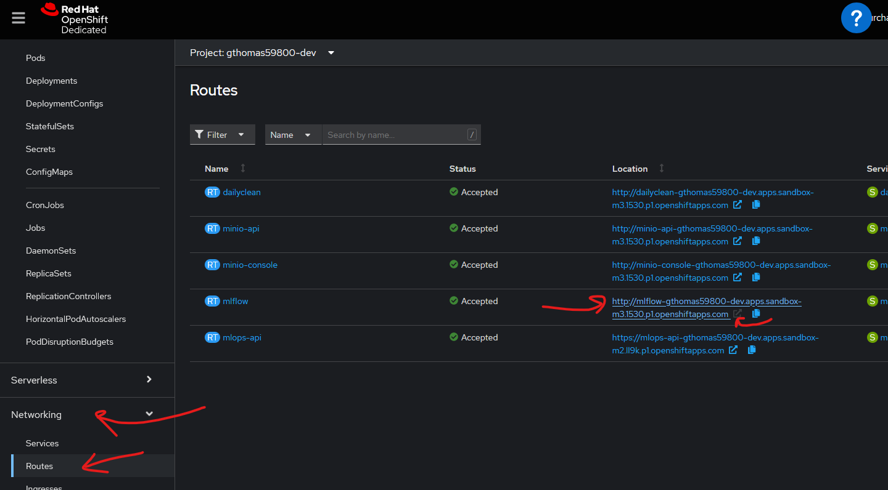


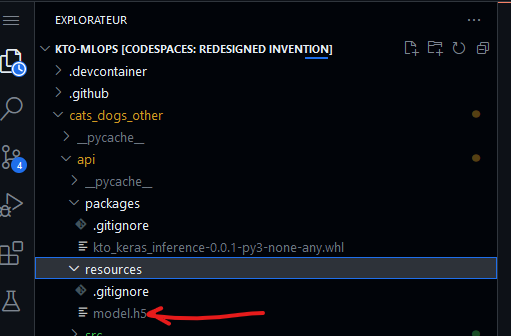

So, to create an instance of the model, we use the inference package and use these code lines :
```python
from kto.inference import Inference

model = Inference("./cats_dogs_other/api/resources/final_model.keras")
```

We have to add them in our index.py script. Note that to avoid performance issues, we will note create a new instance of this model for each http call.
So we create a unique model instance (singleton) directly at the startup of our FastApi application. Now, the index.py script should look like this:
```python
from fastapi import FastAPI
from kto.inference import Inference

app = FastAPI()
model = Inference("./cats_dogs_other/api/resources/final_model.keras")


@app.get("/health")
def health():
    return {"status": "OK"}

```

Now, we create our new route /upload, which allows our clients to send their images and respond the result of this 
classification.

Note that this time, the clients have to send information. So we will use the **POST** verb.

```python
import io
from fastapi import FastAPI, UploadFile
from kto.inference import Inference

app = FastAPI()
model = Inference("./cats_dogs_other/api/resources/final_model.keras")


@app.get("/health")
def health():
    return {"status": "OK"}


@app.post("/upload")
async def upload(file: UploadFile):
    file_readed = await file.read()
    file_bytes = io.BytesIO(file_readed)
    return model.execute(file_bytes)

```

To test your new route, restart your python application (run boot.py) and use Bruno to send an image.

Do not forget to set your Codespaces Port to Public.

In Bruno, create a new Request. It is a POST request, with a body which the content type is form/data. Your part
is named "file" (because you set it in parameter of the upload method in index.py => async def upload(file: UploadFile))

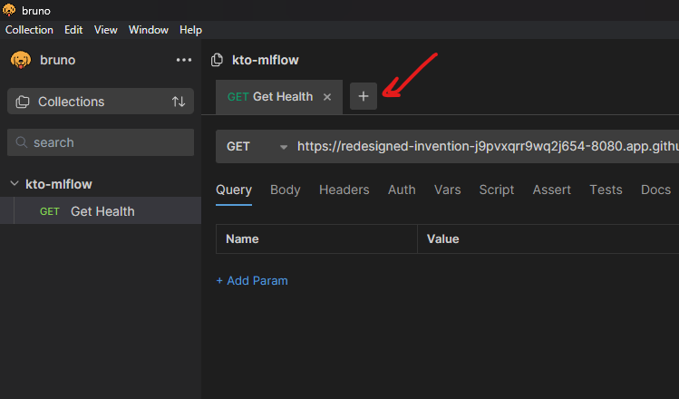

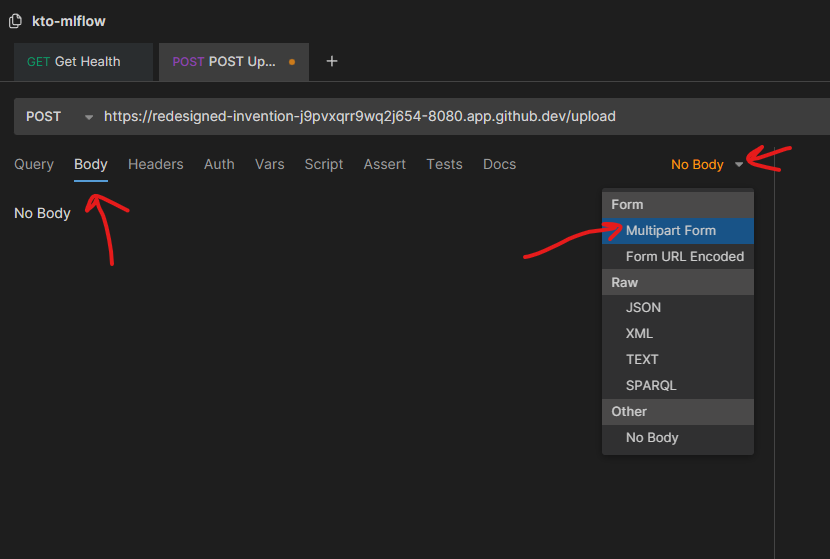

Si finalement, Bruno ne propose toujours pas d'upload de fichiers, testez avec 
[Insomnium](https://github.com/ArchGPT/insomnium/releases). Préférez la version portable.

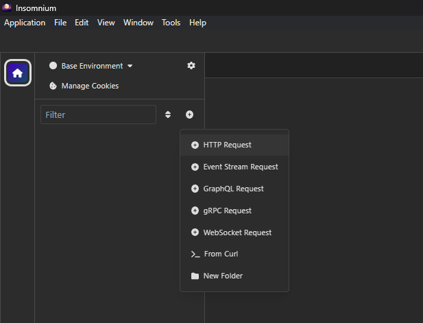
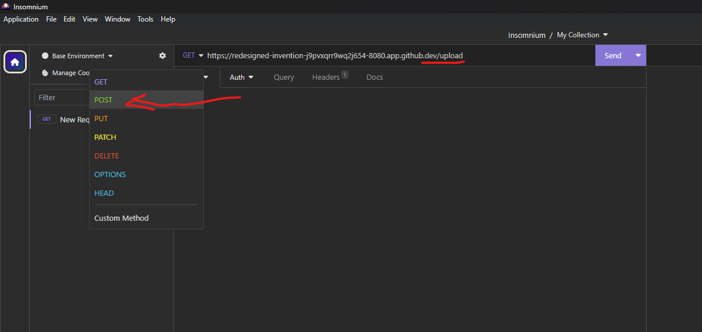
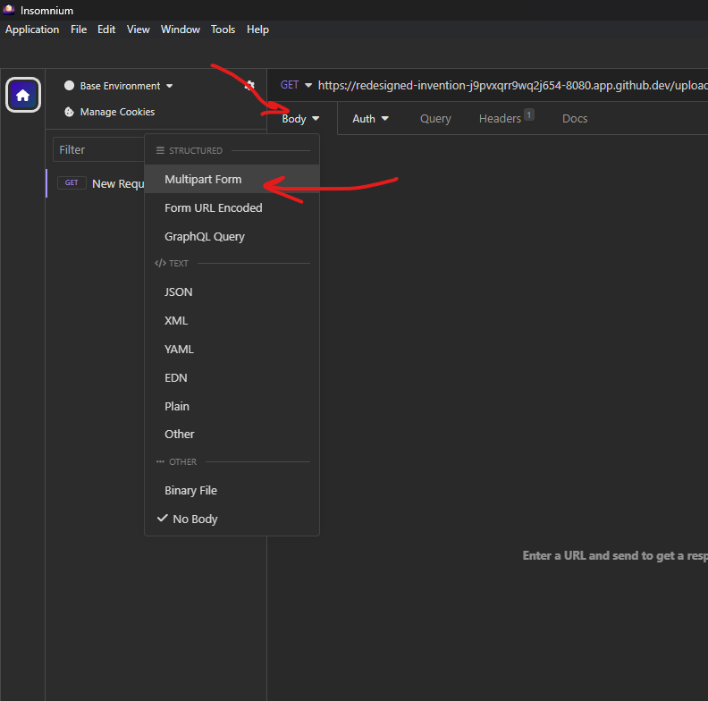
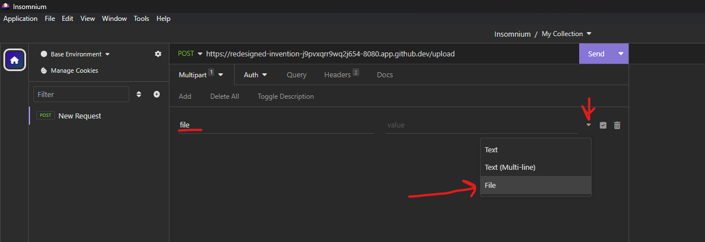
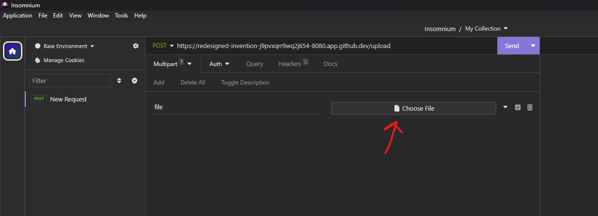


Finally, your test in Postman should look like this:


### e - Unit testing

In this chapter, we will create unit tests to cover our new http routes! To do so, we need to create a 
new script: `test_index.py`.

Create it in the python package `cats_dogs_other.api.src.tests`:


First, we need to create a test client from fastApi. This client allows us to simulate a client call to our WS:
```python
from fastapi.testclient import TestClient
from cats_dogs_other.api.src import index

client = TestClient(index.app)
```

Note that the TestClient class take as attribute a FastApi application instance. We will add the one we want to test.

Now, to begin, we will only test our /health route:
```python
import unittest

from fastapi.testclient import TestClient
from cats_dogs_other.api.src import index

client = TestClient(index.app)


class TestIndex(unittest.TestCase):
    def test_health(self):
        response = client.get("/health")
        self.assertEqual(response.status_code, 200)
        self.assertEqual(response.json(), {"status": "OK"})

```

As you can see, we create a new class that extends TestCase. In this class, we create a new method, test_health().
In this method, we simulate a call to our /health route by ysing the TestClient instance created before.

```python
response = client.get("/health")
```

This call returns a response on which we can do some assertions. We assert that the response code of the http response 
is 200 (ok) and we assert the json content returns.

Now, we test our /upload route by adding a new method, test_upload():
```python
import unittest

from fastapi.testclient import TestClient
from cats_dogs_other.api.src import index

client = TestClient(index.app)


class TestIndex(unittest.TestCase):
    def test_health(self):
        response = client.get("/health")
        self.assertEqual(response.status_code, 200)
        self.assertEqual(response.json(), {"status": "OK"})

    def test_upload(self):
        with open("./cats_dogs_other/api/src/tests/resources/cat.png", "rb") as file:
            response = client.post("/upload", files={"file": ("filename", file, "image/png")})
            self.assertEqual(response.status_code, 200)
            self.assertEqual(response.json()['prediction'], 'Cat')

```

In this method, we open the image of the cat in resources (production/api/src/tests/resources). And we send it to the /upload route with the TestClient instance.

This call returns a new response. We assert the content of this response.

To run this test, please use this command from a Terminal launched from the root of the MLOpsPython project:
```bash
python -m unittest discover -s cats_dogs_other.api.src.tests -t .
```

You should have these results:


### f - Our API with Swagger / OpenAPI

Swagger / OpenAPI is a specification to write APIs. It allows us to define a contract from the server in order to tell to clients of our Webservice how they can use it.

You have two different workflow :
- contract first: you write your API first and you generate your code from it (swagger and openapi gives code generator in a lot of languages => Java, Python, .Net)
- code first: This is the way we chose for this course. We build our Webservice and the Swagger / OpenApi documentation is generate from it

FastApi gives us the possibility to see the swagger of our WebService automatically.

To see it, use the route /docs:


FastAPI generates documentation with Redoc too! To test it, try the route /redoc:


It is the end of this first course. Do not forget to shut down your uvicorn server and your Codespaces environment !!

**Bravo ! Vous avez fait votre premier WebService ! Commitez et poussez vos modifications. Testez votre API de détection
de chat et chien avec Bruno, Insomnium ou plus simplement avec Swagger et faites-moi parvenir par mail une capture d'écran de votre test (évaluations).**

Une fois votre modification poussée, vous devriez remarquer que votre github action ne fonctionne plus. Notamment,
les tests unitaires ne fonctionnent plus. Prenons un peu de temps pour corriger ceci. Revenez sur le fichier 
`.github/workflows/cats-dogs-other.yaml`, identifiez la partie qui traite des tests unitaires et modifiez la par ceci :
```yaml
- name: Upgrade pip, install packages and run unittests
        run: |
          pip install --upgrade pip
          ./init_packages.sh
          pip install -r ./cats_dogs_other/requirements.txt
          pip install -r ./cats_dogs_other/label/requirements.txt
          pip install -r ./cats_dogs_other/api/requirements.txt
          # For tests purposes, we copy an existing .keras file in the folder api/resources
          # We will delete it just after the tests
          cp ./cats_dogs_other/train/steps/tests/test/input/model/final_model.keras ./cats_dogs_other/api/resources/final_model.keras 
          python -m unittest
          rm ./cats_dogs_other/api/resources/final_model.keras
```

Cela doit vous donner ce fichier final :
```yaml
name: Cats and dogs CI/CD
on: 
  push:
    branches:
      - step**

jobs:
  train:
    runs-on: ubuntu-latest
    steps:
      - uses: actions/checkout@v3
      - name: Set up Python 3.11
        uses: actions/setup-python@v3
        with:
          python-version: 3.11
      - name: Upgrade pip, install packages and run unittests
        run: |
          pip install --upgrade pip
          ./init_packages.sh
          pip install -r ./cats_dogs_other/requirements.txt
          pip install -r ./cats_dogs_other/label/requirements.txt
          pip install -r ./cats_dogs_other/api/requirements.txt
          # For tests purposes, we copy an existing .keras file in the folder api/resources
          # We will delete it just after the tests
          cp ./cats_dogs_other/train/steps/tests/test/input/model/final_model.keras ./cats_dogs_other/api/resources/final_model.keras 
          python -m unittest
          rm ./cats_dogs_other/api/resources/final_model.keras
      - name: Install mlflow
        run: |
          pip install mlflow[extras]
      - name: Configure Docker (Quay) & Kubectl (Openshift Sandbox)
        run: |
          docker login -u="${{vars.QUAY_ROBOT_USERNAME}}" -p="${{secrets.QUAY_ROBOT_TOKEN}}" quay.io
          kubectl config set-cluster openshift-cluster --server=${{vars.OPENSHIFT_SERVER}}
          kubectl config set-credentials openshift-credentials --token=${{secrets.OPENSHIFT_TOKEN}}
          kubectl config set-context openshift-context --cluster=openshift-cluster --user=openshift-credentials --namespace=${{vars.OPENSHIFT_USERNAME}}-dev
          kubectl config use openshift-context
      - name: Wake up dailyclean and kto-mlflow
        run: |
          kubectl scale --replicas=1 deployment/dailyclean-api
          sleep 30
          curl -X POST ${{vars.DAILYCLEAN_ROUTE}}/pods/start
      - name: Build training image
        run: |
          docker build -f cats_dogs_other/train/Dockerfile -t quay.io/gthomas59800/kto/train/cats-dogs-other-2023-2024:latest --build-arg MLFLOW_S3_ENDPOINT_URL=${{vars.MLFLOW_S3_ENDPOINT_URL}} --build-arg AWS_ACCESS_KEY_ID=${{vars.AWS_ACCESS_KEY_ID}} --build-arg AWS_SECRET_ACCESS_KEY=${{secrets.AWS_SECRET_ACCESS_KEY}} .
      - name: Launch mlflow training in Openshift
        run: |
          export KUBE_MLFLOW_TRACKING_URI="${{vars.MLFLOW_TRACKING_URI}}"
          export MLFLOW_TRACKING_URI="${{vars.MLFLOW_TRACKING_URI}}"
          export MLFLOW_S3_ENDPOINT_URL="${{vars.MLFLOW_S3_ENDPOINT_URL}}"
          export AWS_ACCESS_KEY_ID="${{vars.AWS_ACCESS_KEY_ID}}" 
          export AWS_SECRET_ACCESS_KEY="${{secrets.AWS_SECRET_ACCESS_KEY}}"
          
          cd cats_dogs_other/train
          mlflow run . --experiment-name cats-dogs-other --backend kubernetes --backend-config kubernetes_config.json
      - name: Asleep kto-mlflow with dailyclean
        run: |
          curl -X POST ${{vars.DAILYCLEAN_ROUTE}}/pods/stop

```

## 2 - Security of our Webservice

### a - Why we should add Security to our Webservice ?

Few arguments:
- Insure to clients that their information are safe and confidentiality
- Block reverse engineering
- Allows a high level of Service Level Agreement / Quality of Service

How a pirate should interfere in our client / server relationship ?


One first mandatory thing to do to insure security is to encrypt requests and results between clients and servers. One solution is to use the Transform
Layer Security protocol. It gives us the ability to extend HTTP to HTTP**S**.

*Demonstration with a web browser*

We will not go further on this protocol because our Cloud providers insure us this capability. But there is a simple thing we can add to our application
to maximize its security.

### b - oAuth2

We will use oAuth2. It is a security standard. Its goal is to delegate the security to an Authorization Server. It will allow clients to
authorize themselves and to insure to the server (our application is a Resource Server in this scenario) that these clients are allowed to do some actions.


The client will authenticate himself and ask to Authorization Server a specific scope for a specific application (our Resource Server). If the credentials
of the client are correct, the Authorization Server will give him a token. This token is often time limited. The client has to give this token
to our application. Our application check that this token is correct and not expired.

### c - An example with Auth0

We will create a free tenant on Auth0 from Okta to illustrate these principles.

Create a free account on https://auth0.com/fr


In this last step, please check the advanced option in order to create your tenant in the EU

Now, our tenant is ready. We have to create a new API :


This API represents our ML Webservice. Now, we create a scope to add permissions to the clients of this api.


Now we have to create the application which will be the client of our API.


To simplify this course, we will use the default application created by Auth0 for tests purposes. Note that it is not a good practice.

Now we add the permissions to this application:


Now we test it with postman !


*Now, let's see what we can find in a token with jwt.io (demo)*

### d - Add security to our Webservice

To ensure that our clients are using a correct oAuth2 token from our Auth0 tenant, we will use advanced features from FastAPI and an open source library.

First, we add a new dependency in the requirements.txt of our api:

```
oidc-jwt-validation==0.3.1
```

This module allows to validate easily the token. In fact, FastAPI gives us just token and made minor validation on it, like the expiration date.
We need to go deeper. For example, we have to validate the signature of the token, the audience and the issuer.

Now, we refresh our environment:

```bash
pip install -r cats_dogs_other/api/requirements.txt
```

Now, we have to make some modifications on the index.py script in order to protect our /upload route:

```python
import io
import logging
import os # this line is new

from fastapi import FastAPI, UploadFile, Depends # here, we add Depends
from fastapi.security import OAuth2PasswordBearer # this line is new
from kto.inference import Inference
from oidc_jwt_validation.authentication import Authentication # this line is new
from oidc_jwt_validation.http_service import ServiceGet # this line is new

app = FastAPI()
model = Inference("./cats_dogs_other/api/resources/final_model.keras")

oauth2_scheme = OAuth2PasswordBearer(tokenUrl="token") # this scheme comes from FastAPI. It allows to check some token information and give the token to the function

issuer = os.getenv("OAUTH2_ISSUER") # This is a value from an environment variable. It allows us to not hard code some information
audience = os.getenv("OAUTH2_AUDIENCE") # this line is new
jwks_uri = os.getenv("OAUTH2_JWKS_URI") # this line is new
logger = logging.getLogger(__name__) # this line is new
authentication = Authentication(logger, issuer, ServiceGet(logger), jwks_uri) # This object will check deeper the validity of the token
skip_oidc = False # this boolean will be used for tests purproses. By default and in production, it will be always False


@app.get("/health") # Note that this line does not change. It will not be protected
def health():
    return {"status": "OK"}


@app.post("/upload")
async def upload(file: UploadFile, token: str = Depends(oauth2_scheme)): # Take a look at this new token argument
    if not skip_oidc:
        await authentication.validate_async(token, audience, "get::prediction") # This function will validate the token
    file_readed = await file.read()
    file_bytes = io.BytesIO(file_readed)
    return model.execute(file_bytes)

```

To test this new code, you need first to add these three environment variables:
- **OAUTH2_ISSUER**: The issuer is the Authorization Server
- **OAUTH2_AUDIENCE**: The audience is the identifier of the API created in Auth0 earlier. Permet de spécifier 
l’entité (par exemple, une application) pour laquelle le jeton d’accès a été émis
- **OAUTH2_JWKS_URI**: This URI allows to get the public keys used to cipher the signature of the token (with Auth0, this value is .well-known/jwks.json. Just have a look of it)

To do so, you can use the linux command `export`

Now you can boot your application, generate a new token from Auth0 with Postman and then, try to predict a cat from Postman.

It is not finish. Now you have to fix your unit tests. In fact, because we protect our /upload route, our tests do not work anymore.

So, to fix them, add these lines to your test_index.py script:

```python
def skip_oauth():
    return {}


index.skip_oidc = True
index.app.dependency_overrides[index.oauth2_scheme] = skip_oauth
```

This code will mock the oAuth2 feature from your index.py script.
You can add it just before this:

```python
client = TestClient(index.app)
```

Now this chapter is finished. Please do not forget to terminate your Codespaces environment.

**De la même manière que la partie d'avant, commitez et poussez vos modifications (avec un nouveau commit) 
et prévenez-moi par mail que je puisse regarder votre code (évaluations)** 
Si possible, j'essaierai de tester en séance que tout fonctionne bien, avec un jeton oAuth fourni par vos soins.